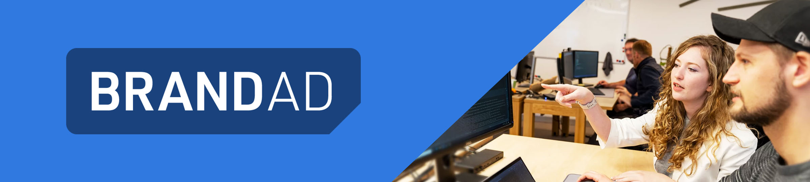
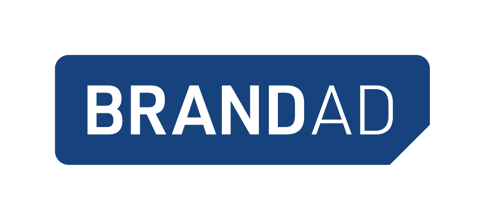

# Hi. Wir sind BRANDAD. 👋

Wir haben dieses Repository angelegt und aufgehübscht, damit uns mögliche neue Kolleginnen und Kollegen (spannend) finden. Sollte dich also die Suche nach einem coolen neuen Arbeitgeber hergeführt haben, dann zeigen wir uns dir gerne von unserer besten Seite => [https://brandad.dev](https://brandad.dev/jobs?utm_source=web&utm_medium=github&utm_campaign=recruiting-offensive2024)

Okay, okay, der Witz mit der „besten Seite“ und unserer Job-Webseite ist ziemlich flach – aber immerhin hast du bis hier gelesen. Höchste Zeit, dass du uns etwas näher kennenlernst. Am besten geht das, indem du dich hier etwas umsiehst:

- **so ticken wir**: Unser [devOS – Operating System of Excellence](https://brandad-group.github.io/devOS/) ist das Herzstück von BRANDAD Development. Die DNS, wenn du so willst – aber nicht die mir der Namensauflösung, sondern die mit den Genen. Dieses *Betriebssystem* haben all unsere Kolleginnen und Kollegen gemeinsam entwickelt; und da stehen unzählige „So arbeiten wir heute schon“ neben ganz vielen „So ticken wir“, ergänzt um einige „So wollen wir morgen arbeiten“. Das ist unser Wegweiser. Unser Nordstern.
- **das passiert nach einer Bewerbung bei uns**: Du bist schon auf einem sehr guten Weg, uns näher kennenzulernen. Solltest du in Erwägung ziehen, dich bei uns zu bewerben, zeigen wir dir hier ganz genau auf, wie die nächsten Schritte aussehen könnten. Nenn es *Recruiting-Transparenz* oder einen *Open-Source-Bewerbungsprozess* – wir nennen es gerne einfach [unsere Kennenlern-Journey](../jobs/kennenlern-journey.md).
- **unsere [Stellenanzeigen](../jobs/jobs.md)**: Stellenangebote? Direkt auf Github? Wow!
- **unser [Blog](https://brandad.dev/blog?utm_source=web&utm_medium=github&utm_campaign=recruiting-offensive2024)**: Du kriegst von uns nicht genug? Dann lies gerne hier weiter.

Und falls du Scrum Masterin oder Fullstack-Entwickler bist, dann bewerben wir uns gerne bei dir als dein nächster Arbeitgeber. Hier ist unser [Anschreiben](../jobs/anschreiben.md) und hier unser [Lebenslauf](../jobs/lebenslauf.md).

---

## aktuelle Jobs (zuletzt aktualisiert: 2024-08-28, 07:03)

### Technischer Product Owner (w/m/d)  

- **Wo?** Fürth, Deutschland
- **Wer?** mit Berufserfahrung
- **Wie?** Festanstellung in Vollzeit
- **Wie genau?** flexibles Arbeiten von Zuhause aus möglich
- **Was? (automatisch gekürzt)** DAS IST DEINE ROLLE: Als „Visionär“ fühlst du dich stets dem Erfolg des Produkts verpflichtet und setzt dein Fokus auf die technischen Aspekte von „WAS“ - in einer engen Zusammenarbeit mit dem strategischen PO bei unserem Kunden. DAS IST DEIN UMFELD:  Zusammen mit den Experten aus der Entwicklung, UX-Engineering sowie Scrum Master bildest du ein stabiles Software-Entwicklungsteam. ...
- **Was jetzt?** [Vollständige Beschreibung, alle Infos](https://brandad.softgarden.io/job/21026240) oder [direkt bewerben](https://jobdb.softgarden.de/jobdb/public/jobposting/applyonline/click?jp=21026240&ADP)

---

### Software­entwickler (w/m/d) - Schwerpunkt: Angular

- **Wo?** Fürth, Deutschland
- **Wer?** mit Berufserfahrung
- **Wie?** Festanstellung in Vollzeit
- **Wie genau?** flexibles Arbeiten von Zuhause aus möglich
- **Was? (automatisch gekürzt)** DAS WARTET AUF DICH: Du entwickelst smarte Softwareprodukte mit End-to-End Verantwortung, überblickst den gesamten Entwicklungsprozess und arbeitest u.a. mit Pair-Programming, Code Reviews und Testautomatisierung an Lösungen auf höchstem Qualitäts-Niveau. Tech-Stack (priorisiert): Angular, TypeScript, Java Spring Boot, HTML/JS, JPA, SQL, Microservices, Git, Gradle, Jenkins, CI/CD, Docker, REST, SOAP  TRIFFT DAS AUF DICH ZU? ...
- **Was jetzt?** [Vollständige Beschreibung, alle Infos](https://brandad.softgarden.io/job/14637273) oder [direkt bewerben](https://jobdb.softgarden.de/jobdb/public/jobposting/applyonline/click?jp=14637273&ADP)

---

### Initiativbewerbung

- **Wo?** Fürth, Deutschland
- **Wer?** mit Berufserfahrung
- **Wie?** Festanstellung in Voll- oder Teilzeit
- **Wie genau?** flexibles Arbeiten von Zuhause aus möglich
- **Was? (automatisch gekürzt)** WIR FREUEN UNS DICH KENNEN ZU LERNEN! Bei BRANDAD Systems entdeckst du die vielseitige Welt zwischen IT und Marketing. ...
- **Was jetzt?** [Vollständige Beschreibung, alle Infos](https://brandad.softgarden.io/job/14636423) oder [direkt bewerben](https://jobdb.softgarden.de/jobdb/public/jobposting/applyonline/click?jp=14636423&ADP)

---

### Fullstack Entwickler (w/m/d)

- **Wo?** Fürth, Deutschland
- **Wer?** mit Berufserfahrung
- **Wie?** Festanstellung in Vollzeit
- **Wie genau?** flexibles Arbeiten von Zuhause aus möglich
- **Was? (automatisch gekürzt)** DEINE MISSION  Du hast tolle Ideen und willst diese umsetzen? Dann bist du bei uns genau richtig. ...
- **Was jetzt?** [Vollständige Beschreibung, alle Infos](https://brandad.softgarden.io/job/14636788) oder [direkt bewerben](https://jobdb.softgarden.de/jobdb/public/jobposting/applyonline/click?jp=14636788&ADP)

---

### Softwareentwickler (w/m/d) - Backend

- **Wo?** Fürth, Deutschland
- **Wer?** mit Berufserfahrung
- **Wie?** Festanstellung in Vollzeit
- **Wie genau?** flexibles Arbeiten von Zuhause aus möglich
- **Was? (automatisch gekürzt)** DIESE AUFGABENFELDER WARTEN AUF DICH:  Du entwickelst neue Produktfeatures und treibst die Verbesserung der Architektur unserer Microservices voran. Im Vorfeld der Sprints analysierst und beurteilst du User Stories. ...
- **Was jetzt?** [Vollständige Beschreibung, alle Infos](https://brandad.softgarden.io/job/14638203) oder [direkt bewerben](https://jobdb.softgarden.de/jobdb/public/jobposting/applyonline/click?jp=14638203&ADP)

---

### Softwareentwickler (w/m/d) - Frontend

- **Wo?** Fürth, Deutschland
- **Wer?** mit Berufserfahrung
- **Wie?** Festanstellung in Vollzeit
- **Wie genau?** flexibles Arbeiten von Zuhause aus möglich
- **Was? (automatisch gekürzt)** DIESE AUFGABEN WARTEN AUF DICH: Wir erklären dir als Frontend-Entwickler ganz sicher nicht, wie du deinen Job machen sollst – nichthier und auch nicht, wenn du bei uns anfängst. Deine Eigenverantwortung sowie die Verantwortungdeinen Kolleginnen und Kollegen gegenüber sind uns immens wichtig. ...
- **Was jetzt?** [Vollständige Beschreibung, alle Infos](https://brandad.softgarden.io/job/14637498) oder [direkt bewerben](https://jobdb.softgarden.de/jobdb/public/jobposting/applyonline/click?jp=14637498&ADP)

---

### Senior Scrum Master/Agile Coach (w/m/d)

- **Wo?** Fürth, Deutschland
- **Wer?** mit Berufserfahrung
- **Wie?** Festanstellung in Voll- oder Teilzeit
- **Wie genau?** flexibles Arbeiten von Zuhause aus möglich
- **Was? (automatisch gekürzt)** DAS IST DEINE ROLLE: Den Job als Scrum Master/Agile Coach müssen wir dir nicht erklären, deine Rolle kennst du selbst am besten. DAS IST DEIN UMFELD:  Du begleitest genau ein Software-Entwicklungsteam auf seinem Weg, so dass du den Fokus auf das Team halten kannst und auch genug Zeit hast, innerhalb des Unternehmens Dein Umfeld mitzugestalten. ...
- **Was jetzt?** [Vollständige Beschreibung, alle Infos](https://brandad.softgarden.io/job/14636793) oder [direkt bewerben](https://jobdb.softgarden.de/jobdb/public/jobposting/applyonline/click?jp=14636793&ADP)

---

### Projektmanager im MarTech-Umfeld  (w/m/d)

- **Wo?** Fürth, Deutschland
- **Wer?** mit Berufserfahrung
- **Wie?** Festanstellung in Vollzeit
- **Wie genau?** flexibles Arbeiten von Zuhause aus möglich
- **Was? (automatisch gekürzt)** Mit unserer Marketing-Plattform Brand Base helfen wir großen Marken und ihren Partnern am Point of Sale (POS) dabei, erfolgreiches lokales Marketing zu machen – maximal effektiv, automatisiert und über alle Kanäle hinweg. Viele großartige Menschen sind bereits an Bord der BRANDAD Solutions, um diese Mission gemeinsam zu bestreiten. ...
- **Was jetzt?** [Vollständige Beschreibung, alle Infos](https://brandad.softgarden.io/job/45230017) oder [direkt bewerben](https://jobdb.softgarden.de/jobdb/public/jobposting/applyonline/click?jp=45230017&ADP)

---

### UX/UI Designer (w/m/d)

- **Wo?** Fürth, Deutschland
- **Wer?** mit Berufserfahrung
- **Wie?** Festanstellung in Vollzeit
- **Wie genau?** flexibles Arbeiten von Zuhause aus möglich
- **Was? (automatisch gekürzt)** AUF DIESE AUFGABENFELDER KANNST DU DICH FREUEN:  In einem crossfunktionalen Entwicklerteam verantwortest du alle Facetten der User Experience. Du übernimmst die Konzeption von ersten Entwürfen bis hin zum finalen UI-Design, dabei steht der Human Centered Design Prozess für dich an erster Stelle. ...
- **Was jetzt?** [Vollständige Beschreibung, alle Infos](https://brandad.softgarden.io/job/14637288) oder [direkt bewerben](https://jobdb.softgarden.de/jobdb/public/jobposting/applyonline/click?jp=14637288&ADP)

---
